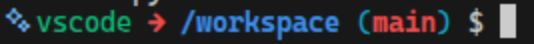

# Clash Royale Post-Game Analyzer

A computer vision and statistical modeling pipeline that analyzes Clash Royale match replays to evaluate decision-making, calculate expected value (EV) of card plays, and detect suboptimal moves.

## Quick Start

### Prerequisites

- [Docker Desktop](https://www.docker.com/products/docker-desktop/)
- [VS Code](https://code.visualstudio.com/) with the [Dev Containers](https://marketplace.visualstudio.com/items?itemName=ms-vscode-remote.remote-containers) extension

### Setup

1. Clone the repo
   ```bash
   git clone <repo-url>
   cd Clash-Royale-Pod
   ```
2. Open in VS Code
   ```bash
   code .
   ```
3. When prompted, click **"Reopen in Container"** (or press ctrl+shift+p and run `Dev Containers: Reopen in Container` from the command palette)

*Windows users*: If the container build fails with `\r': command not found` errors, your git converted files to Windows line endings. Fix it by running this **outside** the container before reopening:
   ```bash
   git pull
   git rm --cached -r .
   git reset --hard
   ```
4. Wait for the container to build (~3-5 min the first time)
5. Verify everything works:
   ```bash
   uv run python -c "import torch; import cv2; import ultralytics; print('ready')"
   ```
   **AND**
   ```bash
   bash .devcontainer/test_tools.sh
   ```

That's it. Python, PyTorch, YOLO, OpenCV, FFmpeg, Tesseract, and all dependencies are pre-installed.

### Make sure your virtual environment is activated

When you open a terminal in VS Code, the Python extension should automatically activate the `.venv`. You can tell by looking at your terminal prompt — it should start with `(workspace)` (Be patient and wait a couple of seconds before running the source command 😊)

**BAD**



**GOOD**


If you don't see `(workspace)` in your prompt, activate it manually:
```bash
source .venv/bin/activate
```

**Why this matters:** Without the venv activated, `python` uses the system Python (3.12) which doesn't have your project's packages installed. With it activated, `python` uses the project's Python (3.11) with all dependencies available.

## Project Structure (Ignore for now)

```
Clash-Royale-Pod/
├── .devcontainer/          # Docker + devcontainer config
│   ├── Dockerfile
│   ├── devcontainer.json
│   ├── docker-compose.yml
│   └── test_tools.sh
├── .vscode/                # VS Code settings (auto-format, linting)
├── data/                   # Match replays, frames, annotations (gitignored)
├── output/                 # Pipeline outputs (gitignored)
│   ├── frames/             # Extracted frames
│   ├── annotations/        # COCO-format labels
│   ├── models/             # Trained model weights
│   └── events/             # Per-match event logs
├── Makefile                # Dev commands (lint, format, sync, etc.)
├── pyproject.toml          # Python dependencies (managed by uv)
├── uv.lock                 # Locked dependency versions
├── pod_summary.md          # Project proposal
└── workflow.md             # Team workflow and collaboration guide
```

## Common Commands

| Command | What it does |
| ------- | ------------ |
| `uv sync` | Install/sync all dependencies from lockfile |
| `uv add <package>` | Add a new dependency |
| `uv run python script.py` | Run a script in the project environment |
| `make lint` | Run ruff linter |
| `make format` | Auto-format code with ruff |
| `make type-check` | Run mypy type checker |

## Git Workflow

We use the **Shared Repo + Pull Request** workflow. Everyone works on the same repo — no forks. No one pushes directly to `main` — all changes go through PRs that are reviewed and merged by the maintainer (@max).

### First-time setup (do this once)

1. **Get added as a collaborator** — ask @max to add you to the repo on GitHub (Settings → Collaborators).
2. **Clone the repo:**
   ```bash
   git clone https://github.com/<repo-owner>/Clash-Royale-Pod.git
   cd Clash-Royale-Pod
   ```
3. Open in VS Code and reopen in the dev container (see [Quick Start](#quick-start)).

That's it. No forks, no upstream remotes. Everyone pushes to the same repo.

### Already have a fork?

If you previously forked the repo, you can switch to the shared model. Delete your fork on GitHub, then update your local clone to point at the main repo:

```bash
# Check your current remote
git remote -v

# If origin points to your fork, update it to the main repo
git remote set-url origin https://github.com/<repo-owner>/Clash-Royale-Pod.git

# Verify
git remote -v
```

### The workflow for every task

1. **Pull the latest main** before starting new work:
   ```bash
   git checkout main
   git pull
   ```
2. **Create a branch** for your specific task:
   ```bash
   git checkout -b data/add-annotation-script
   ```
3. **Do your work and commit** with descriptive messages:
   ```bash
   git add <files>
   git commit -m "data: add annotation script for tower labels"
   ```
4. **Push your branch:**
   ```bash
   git push -u origin data/add-annotation-script
   ```
5. **Open a Pull Request** on GitHub from your branch to `main`.
6. **Review & merge** — automated checks run, the maintainer reviews the code, and once approved it gets merged.

### Collaborating within a subgroup (multi-person features)

When two or more people in the same subgroup need to work on the same feature, use a shared feature branch with sub-branches:

1. **Person A creates the shared feature branch:**
   ```bash
   git checkout main
   git pull
   git checkout -b tracking/bytetrack
   git push -u origin tracking/bytetrack
   ```

2. **Person B pulls the shared branch:**
   ```bash
   git fetch
   git checkout tracking/bytetrack
   ```

3. **Each person creates a sub-branch off the shared branch:**
   ```bash
   # Person A
   git checkout tracking/bytetrack
   git checkout -b tracking/bytetrack-detection

   # Person B
   git checkout tracking/bytetrack
   git checkout -b tracking/bytetrack-scoring
   ```

4. **Each person pushes their sub-branch and PRs into the shared branch (not `main`):**
   ```bash
   # Person A
   git checkout tracking/bytetrack-detection
   git push -u origin tracking/bytetrack-detection
   ```
   Then on GitHub: open a PR and **change the base branch** from `main` to `tracking/bytetrack` (click the base dropdown).

   Person B does the same:
   ```bash
   git checkout tracking/bytetrack-scoring
   git push -u origin tracking/bytetrack-scoring
   ```
   Same thing on GitHub: PR into `tracking/bytetrack`.

5. **After both sub-PRs are reviewed and merged**, PR the shared branch into `main`:
   ```bash
   git checkout tracking/bytetrack
   git pull
   ```
   Then on GitHub: open a PR from `tracking/bytetrack` → `main`.

6. **Clean up after the PR is merged:**
   ```bash
   git checkout main
   git pull
   git branch -d tracking/bytetrack
   git branch -d tracking/bytetrack-detection
   git branch -d tracking/bytetrack-scoring
   ```
   GitHub will also show a "Delete branch" button on each merged PR to clean up the remote branches.

### Updating an open PR

When the maintainer reviews your PR and requests changes, you don't need to open a new PR. Just push more commits to the same branch — the PR updates automatically:

```bash
# You're still on your branch
git checkout data/add-annotation-script

# Make the requested fixes
git add <files>
git commit -m "data: fix edge case in annotation parser"

# Push to the same branch — the PR updates automatically
git push
```

### Branch naming

Use a prefix matching your sub-team:
- `data/*` — Data & Detection
- `tracking/*` — Tracking & Feature Engineering
- `modeling/*` — Modeling & Visualization
- `docs/*` — Documentation

### Keep branches short-lived

A branch should be created for a specific task, worked on for a few days, PR'd, merged, and then deleted. Don't let branches sit for weeks — the longer a branch lives, the more `main` changes underneath it, and the more likely you are to hit merge conflicts. Finish the task, open the PR, get it merged, move on.

### Handling merge conflicts

Conflicts happen when two people edit the same lines in the same file. If your PR shows a conflict:

```bash
# Update your local main
git checkout main
git pull

# Merge main into your branch
git checkout data/my-branch
git merge main
```

Git will mark conflicts in the file. Open it, pick the correct version, remove the `<<<<<<<` / `=======` / `>>>>>>>` markers, then:

```bash
git add <conflicted-file>
git commit -m "data: resolve merge conflict"
git push
```

**To minimize conflicts:** pull often, keep branches short-lived, and try to split work by file when possible (if you own `annotate.py` and your teammate owns `train.py`, you'll almost never conflict).

## Project Management

### Branch protection

The `main` branch is protected. No one can push to it directly — all changes must go through a Pull Request and be approved by the maintainer.

### Issue tracker

Use GitHub Issues to report bugs, propose features, and organize tasks. Reference issues in your commits and PRs (e.g., `fixes #12`).

### Maintainer

@max holds merge privileges and reviews all PRs. If your PR is ready for review, request a review from @max on GitHub.

## Managing Dependencies Across the Team

Since we use **uv + `pyproject.toml`**, adding packages on feature branches merges cleanly:

1. **Add a package** on your branch: `uv add <package>` — this updates `pyproject.toml` and `uv.lock`.
2. **Include both files** in your PR commit.
3. **On merge**, Git auto-merges `pyproject.toml` as long as different people edited different lines. If there's a conflict in `uv.lock`, resolve `pyproject.toml` first, then run `uv lock` to regenerate the lockfile.

### When main is updated

After pulling the latest changes from main, check what files changed and follow the appropriate steps:

| What changed | What to do |
| ------------ | ---------- |
| `pyproject.toml` / `uv.lock` (new Python packages) | Run `uv sync` — no rebuild needed |
| `Makefile` or `.devcontainer/test_tools.sh` | No action needed, changes apply automatically |
| `Dockerfile`, `devcontainer.json`, or `docker-compose.yml` | **Rebuild the container** (see below) |

**To rebuild:** Open the VS Code command palette and run `Dev Containers: Rebuild Container`. This will rebuild the image and re-run the setup. You will need to re-authenticate the AI coding tools after a rebuild.

If you're unsure what changed, you can always run `uv sync` (safe to run anytime) and check if a rebuild is needed:
```bash
git diff main@{1} --name-only | grep -E "Dockerfile|devcontainer.json|docker-compose.yml"
```
If that returns any files, rebuild. Otherwise `uv sync` is enough.

## Sub-Teams

| Team | Owns |
| ---- | ---- |
| **Data & Detection** | Replay collection, annotation in Roboflow, YOLO training |
| **Tracking & Feature Engineering** | ByteTrack (via supervision), Tesseract OCR, event log construction |
| **Modeling & Visualization** | LightGBM, EV calculations, heatmaps, statistical analysis |

## AI Coding Tools

The container comes with three AI coding assistants pre-installed. After your first container build, authenticate each one by running the command in the terminal:

| Tool | Command | Auth |
| ---- | ------- | ---- |
| [Claude Code](https://claude.ai) | `claude` | Log in with your Claude account |
| [Gemini CLI](https://geminicli.com) | `gemini` | Log in with your Google account |
| [Codex CLI](https://github.com/openai/codex) | `codex` | Log in with your ChatGPT account |

You only need to authenticate once per container rebuild.

## Key Docs

- **[pod_summary.md](pod_summary.md)** — Full project proposal, research question, algorithm design
- **[workflow.md](workflow.md)** — Team structure, communication, interface contracts, weekly cadence

## Tech Stack

| Tool | Purpose |
| ---- | ------- |
| Python 3.11 | Primary language |
| PyTorch + Ultralytics YOLO | Object detection (troops, spells, structures) |
| OpenCV + FFmpeg | Video/frame extraction and processing |
| supervision | Multi-object tracking (ByteTrack) |
| Tesseract | OCR for HUD reading (elixir, timers, tower HP) |
| LightGBM | EV modeling and outcome prediction |
| pandas / NumPy / SciPy | Data wrangling and statistical analysis |
| matplotlib / seaborn | Visualization |
| uv | Python package and environment management |
| Ruff | Linting and formatting |
| Claude Code / Gemini CLI / Codex CLI | AI coding assistants |
